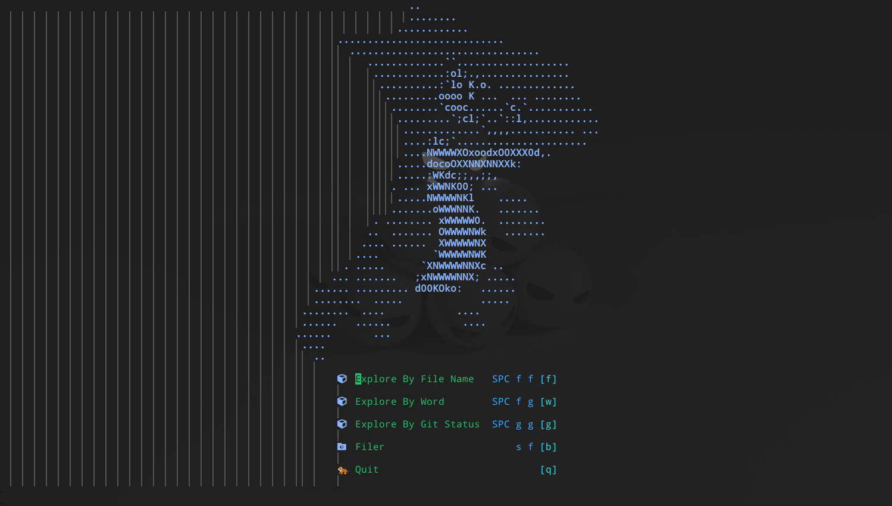

# dotfiles


As you can see, this is dotfiles (for unix).



## What this dotfiles can do:

- neovim
- tmux
- zsh (z, fzf)
- [other] (bat, fuck, trans, shellcheck)

## Installation

> In order to apply p10k-setup, you need to relogin.

```bash
cd dotfiles && ./install

# for zshrc
rm ~/.zshrc*
ln -sf $(pwd)/.zshrc ~/.zshrc
source ~/.zshrc

# for powerlevel10k
./p10k-setup

# for neovim
nvim --headless -c "exit"
```

## Note

- [Link to note](docs/note.md)

## Neovim Features

<table>
  <tr>
    <td><b>Features</b></td>
    <td><b>Plugins</b></td>
  </tr>
  <tr>
    <td>Plugin Management</td>
    <td>lazy.nvim</td>
  </tr>
  <tr>
    <td>Fuzzy Finder</td>
    <td>telescope.nvim</td>
  </tr>
  <tr>
    <td>Syntac Highlight</td>
    <td>nvim-treesitter</td>
  </tr>
  <tr>
    <td>Filer</td>
    <td>fern.vim</td>
  </tr>
  <tr>
    <td>Registers</td>
    <td>registers.nvim</td>
  </tr>
  <tr>
    <td>Bufferline</td>
    <td>bufferline.nvim</td>
  </tr>
  <tr>
    <td>Statusline</td>
    <td>lualine.nvim</td>
  </tr>
  <tr>
    <td>Colorschemes</td>
    <td>nightfox.nvim</td>
  </tr>
  <tr>
    <td>LSP</td>
    <td>nvim-lspconfig + mason</td>
  </tr>
  <tr>
    <td>CMP</td>
    <td>nvim-cmp</td>
  </tr>
  <tr>
    <td>Snipets</td>
    <td>LuaSnip</td>
  </tr>
  <tr>
    <td>Debugger</td>
    <td>nvim-dap</td>
  </tr>
  <tr>
    <td>Dashboard</td>
    <td>dashboard-nvim</td>
  </tr>
  <tr>
    <td>Comment</td>
    <td>nvim-comment</td>
  </tr>
  <tr>
    <td>Diagnostics</td>
    <td>trouble.nvim</td>
  </tr>
  <tr>
    <td>Notification</td>
    <td>noice.nvim</td>
  </tr>
  <tr>
    <td>Auto Pairs</td>
    <td>nvim-surround, nvim-autopairs</td>
  </tr>
  <tr>
    <td>Indent-line</td>
    <td>indent-blankline.nvim</td>
  </tr>
  <tr>
    <td>Splitting/Joining blocks</td>
    <td>treesj</td>
  </tr>
  <tr>
    <td>Git Operation</td>
    <td>neogit.nvim, gitsigns.nvim</td>
  </tr>
  <tr>
    <td>AI Support</td>
    <td>ChatGPT.nvim</td>
  </tr>
  <tr>
    <td>Language Specific</td>
    <td>↓</td>
  </tr>
  <tr>
    <td>Rust</td>
    <td>rust.vim, rust-tools.nvim</td>
  </tr>
  <tr>
    <td>YARA</td>
    <td>vim-syntax-yara</td>
  </tr>
  <tr>
    <td>Markdown</td>
    <td>markdown-preview.nvim</td>
  </tr>
</table>
